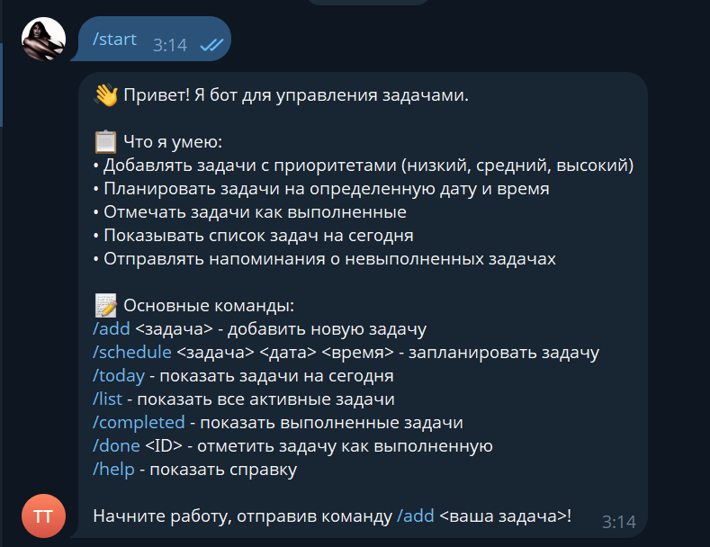
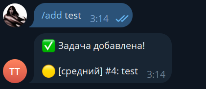
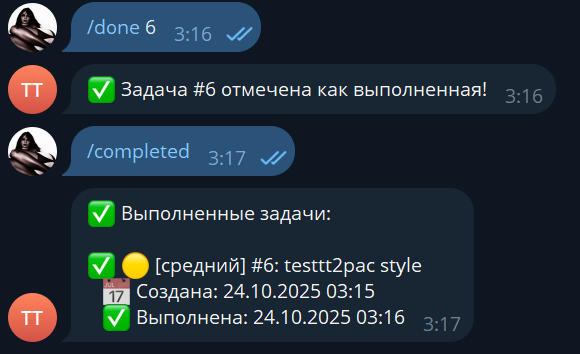
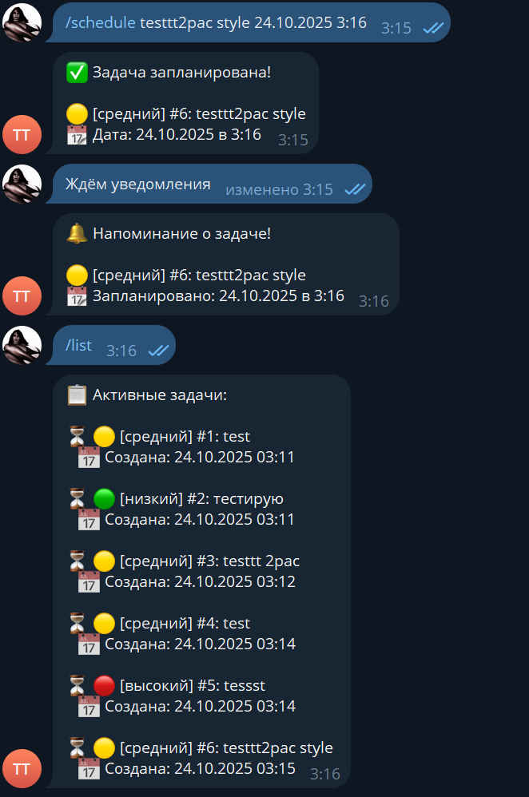
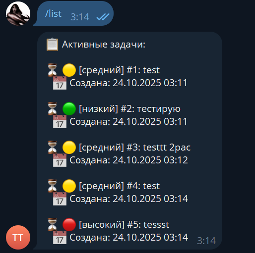

# Отчёт по лабораторной работе  
## Тема: Создание первого Telegram-бота без программирования  

---

### **Описание задачи**

В рамках лабораторной работы был создан Telegram-бот для управления задачами.  
Бот позволяет пользователям добавлять, просматривать и отмечать задачи как выполненные, а также назначать приоритеты и планировать их на конкретные дату и время.

**Проблема, которую решает бот:**  
Организация личных и рабочих дел без необходимости использовать сложные таск-менеджеры. Всё происходит прямо в Telegram — быстро и удобно.

**Почему выбрана именно эта задача:**  
Задачник — понятный и востребованный инструмент, полезный как студентам, так и командам. Он хорошо демонстрирует базовые принципы работы Telegram-ботов, включая команды, хранение данных и обработку ошибок.

---

### **Промпт для LLM**

#### Исходный промпт

```text
Создай Telegram-бота на Python с использованием библиотеки python-telegram-bot.

Функционал бота:

Принимает задачи в текстовом виде от пользователя.

Хранит задачи в локальном файле (JSON).

Позволяет отмечать задачи как выполненные.

Организует задачи по приоритетам (низкий, средний, высокий).

Отправляет напоминания о невыполненных задачах.

Команда /today показывает список задач на день.

Команда /add добавляет новую задачу.

Команда /done отмечает задачу как выполненную.

Команда /list показывает все активные задачи.

Команда /help выводит краткую справку по использованию.

Требования:

Бот должен быть простым и понятным.

Код должен быть хорошо прокомментирован, особенно логика работы с задачами.

Использовать JSON-файл для хранения данных.

Добавить обработку ошибок (например, если пользователь вводит некорректную команду).

Реализовать структуру проекта с несколькими файлами:

bot.py — основной код бота

requirements.txt — список зависимостей

README.md — инструкция по запуску (включая установку зависимостей и настройку токена)

.env.example — пример файла с переменной BOT_TOKEN

Дополнительно:

Реализуй логирование (например, через модуль logging).

При старте бот должен приветствовать пользователя и кратко объяснять, что он умеет.
```

---
#### Итерации и улучшения
После первой генерации код был дополнен:
- Поддержкой планирования задач по дате и времени  
- Улучшенной обработкой ошибок  
- Совместимостью с Python 3.13 (обновлена библиотека `python-telegram-bot` до версии 21.0)  
- Добавлены эмодзи для приоритетов и логирование операций

#### Финальный промпт

```text
Создай Telegram-бота на Python с использованием библиотеки python-telegram-bot==21.0.

Функционал:

Добавление задач с приоритетами

Планирование задач на конкретную дату и время

Просмотр задач на сегодня

Отметка задач как выполненных

Хранение данных в JSON

Напоминания о невыполненных задачах

Требования:

Простая структура проекта (bot.py, requirements.txt, README.md, .env.example)

Хорошо прокомментированный код

Логирование через модуль logging

Обработка ошибок
```

---

### **Стек технологий**

**Язык:** Python 3.13  
**Библиотеки:**
- `python-telegram-bot==21.0` — основная библиотека для взаимодействия с Telegram API  
- `python-dotenv==1.0.0` — загрузка токена из файла `.env`  
- `json` — хранение данных о задачах  
- `logging` — запись логов для диагностики и отладки  

**Почему выбраны именно они:**  
`python-telegram-bot` — одно из самых стабильных решений для работы с Telegram API.  
`dotenv` и `json` обеспечивают простоту настройки и хранения данных без дополнительной базы.  
`logging` позволяет отслеживать работу бота без внешних сервисов.

---

### **Скриншоты и видео**











**Видео-демо:**  
[Ссылка на Google Drive](https://drive.google.com/file/d/12lRxCtTfnu7Yr8Gg8f2SDlvW8WCp_XDF/view?usp=sharing)

---

### **Трудности и решения**

| Проблема | Решение |
|-----------|----------|
| Несовместимость версии `python-telegram-bot` с Python 3.13 | Обновлена до версии 21.0 |
| Ошибки при загрузке токена | Добавлен `.env.example` и обработка ошибок при отсутствии токена |
| Хранение данных нескольких пользователей | Добавлено разделение задач по `user_id` |
| Планирование задач | Расширена структура JSON с полями `scheduled_date` и `scheduled_time` |

---

### **Выводы**

**Что получилось хорошо:**  
- Бот стабильно работает и хранит задачи каждого пользователя отдельно.  
- Код читаемый и хорошо структурирован.  
- Интерфейс понятен — команды интуитивные.

**Что можно улучшить:**
- Добавить web-панель для визуального управления задачами.  
- Реализовать синхронизацию с Google Calendar.

**Чему научились:**  
- Использовать LLM для генерации рабочего кода Telegram-ботов.  
- Понимать структуру проекта и взаимодействие с API.  
- Настраивать окружение и управлять зависимостями.  
- Правильно формулировать запросы к LLM для получения точных результатов.

---
