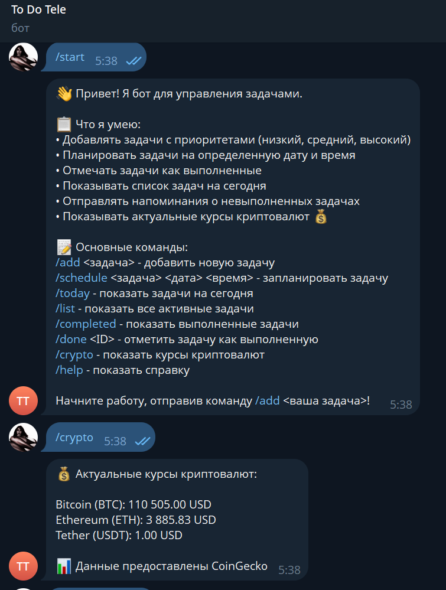

# Отчёт по лабораторной работе  
## Тема: Подключение Telegram-бота к данным (API CoinGecko)

---

### **Описание задачи**

В рамках лабораторной работы был создан Telegram-бот, который отображает актуальные курсы трёх ведущих криптовалют — **Bitcoin (BTC)**, **Ethereum (ETH)** и **Tether (USDT)** — с использованием публичного API CoinGecko.  

**Цель работы:**  
Научиться подключать бота к внешнему источнику данных (API), обрабатывать ответы и отображать их в удобном формате для пользователя.  

**Задача, которую решает бот:**  
Предоставление свежих данных о курсах криптовалют прямо в Telegram без необходимости заходить на сайты или использовать биржевые приложения.  

---

### **Промпт для LLM**

#### Исходный промпт

```text
Улучши моего Telegram-бота, добавив интеграцию с публичным API для отображения актуальных курсов криптовалют.

Текущий функционал бота:
Бот сейчас отвечает на простые команды и сообщения пользователей, но не работает с внешними данными.

Новый функционал:
- Добавить команду /crypto, которая показывает актуальные курсы топ-3 криптовалют (Bitcoin, Ethereum, Tether).
- Использовать публичный API CoinGecko для получения данных.
- Выводить данные в удобном виде:
  💰 Актуальные курсы криптовалют:
  Bitcoin (BTC): 68300 USD
  Ethereum (ETH): 3540 USD
  Tether (USDT): 1.00 USD
- Обрабатывать ошибки сети и некорректные ответы API.
- Сохранить текущий функционал бота.
- Добавить понятные комментарии в код.

Данные:
API CoinGecko (эндпоинт):
https://api.coingecko.com/api/v3/simple/price?ids=bitcoin,ethereum,tether&vs_currencies=usd

Требования:
- Код должен быть простым и читаемым.
- Добавить обработку ошибок.
- Не удалять существующие команды.
- Поддерживать Python 3.9+.

Создай:
1. Обновленный bot.py с новым функционалом.
2. Обновленный README.md с описанием команды /crypto.
Реализация

Стек технологий:

Язык: Python 3.11

Библиотеки:

python-telegram-bot==21.0 — взаимодействие с Telegram API

requests — выполнение HTTP-запросов к CoinGecko

logging — логирование ошибок и действий

Основная логика работы:

При вызове команды /crypto бот отправляет запрос к API CoinGecko.

Получает JSON-ответ с курсами в долларах США.

Форматирует сообщение и отправляет пользователю.

Если API недоступен — сообщает об ошибке.

```

### **Трудности и решения**

| Проблема | Решение |
|-----------|----------|
|Ошибка при обращении к API (код 429) | Добавлено ограничение частоты запросов и обработка исключений |

---

### **Скриншоты и видео**



**Видео-демо:**  
[Ссылка на Google Drive](https://drive.google.com/file/d/1srah4i5_1JAnDggl5uemm9swKSIef4RJ/view?usp=sharing)

---
### **Выводы**

**Что получилось хорошо:**  
- Бот корректно получает и отображает курсы криптовалют.
- Код понятен, содержит комментарии и обработку ошибок.
- API CoinGecko интегрировано успешно.

**Что можно улучшить:**
- Добавить выбор валюты пользователем (например, EUR или RUB).
- Реализовать кэширование данных, чтобы не перегружать API.

**Чему научились:**  
- Работа с внешними API через библиотеку requests.
- Формулировка промптов для генерации кода с помощью LLM.
- Обработка ошибок сетевых запросов и форматирование JSON-данных.

---