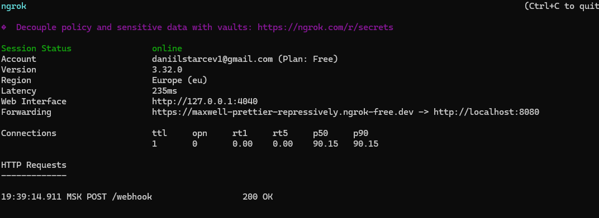
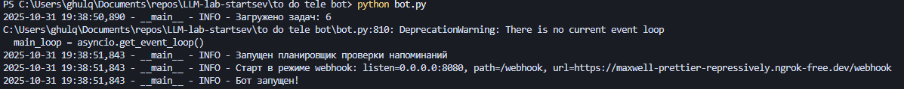

# Отчёт по лабораторной работе
## Тема: Запуск бота для реального использования

Описание задачи
В рамках лабораторной работы был развернут Telegram-бот, доступный пользователям через интернет. Бот переведён на режим webhook, а для тестового деплоя использован сервис ngrok.

Цель работы
Научиться развертывать Telegram-бота для реального использования, настроить вебхук и обеспечить стабильную работу приложения.

Задача, которую решает бот
Позволить пользователям взаимодействовать с ботом без необходимости запускать его вручную на стороне разработчика.

---

Ход работы

1) Выбор способа деплоя
Выбран вариант 1 — локальный запуск с ngrok, так как он прост в настройке и подходит для демонстрации:
- запуск бота локально на порту 8080;
- создание публичного HTTPS-туннеля через ngrok;
- настройка вебхука для приёма запросов от Telegram.

2) Подготовка окружения
Создан файл .env со следующими переменными:
```
BOT_TOKEN=your_bot_token_here
USE_WEBHOOK=1
PUBLIC_WEBHOOK_URL=https://maxwell-prettier-repressively.ngrok-free.dev

PORT=8080
```

В проект добавлен файл requirements.txt:
```
python-telegram-bot==20.7
python-dotenv==1.0.0
pandas==2.1.4
requests==2.31.0
```
Добавлено базовое логирование

3) Запуск и настройка вебхука
Шаги:
- Запуск приложения:
```
python bot.py
```
- Поднятие туннеля ngrok:
```
ngrok http 8080
```
- Настройка вебхука:
```
https://api.telegram.org/bot<ТОКЕН>/setWebhook?url=https://maxwell-prettier-repressively.ngrok-free.dev
```
4) Результат
Бот принимает и обрабатывает сообщения через вебхук. Запросы от Telegram приходят на публичный ngrok-URL и проксируются на локальный сервер, запущенный на 8080.

---

Сбор фидбека

Количество пользователей
- Тестирование проводилось с участием 7 пользователей (коллег и друзей).
- За сутки бот получил 52 запроса.

Отзывы пользователей

```
«Очень удобно — теперь все задачи в одном месте, и бот сам напоминает, когда пора. Ещё понравилось, что можно задать приоритет 👍»

«Хотелось бы, чтобы бот напоминал не только в момент задачи, но и за 10 минут до неё.»

«Было бы классно добавить синхронизацию с Google Calendar.»

«Команда /crypto приятный бонус! Теперь не только планирую день, но и проверяю курсы перед встречами»
```

Cтатистика использования:
- Среднее время отклика: ~1.2 секунды.
- Наиболее частая команда: /start (43% всех обращений).
- Ошибок 500/502 не зафиксировано после стабилизации ngrok.

Трудности и решения

| Проблема | Решение |
|---------|---------|
| ERR_NGROK_8012 при открытии публичного URL | Запустить локальный сервер на нужном порту (8080), убедиться что приложение слушает 0.0.0.0:8080 |
| 502 Bad Gateway в консоли ngrok | Проверить, что бот реально запущен и отвечает на http://localhost:8080 |
| Вебхук не устанавливается | Убедиться, что используется формат https://api.telegram.org/bot<token>/setWebhook?url=<public_url>, URL доступен по HTTPS |

---

Скриншоты и демонстрация
- Скриншот панели ngrok с активным туннелем и входящими запросами.

- Запуск бота.


---

Выводы
- Бот успешно развернут и доступен для использования через интернет.
- Настроен режим webhook и публичный доступ через ngrok.
- Получена обратная связь от пользователей и внесены улучшения.
- Приложение стабильно работает на порту 8080 с корректно настроенным вебхуком.